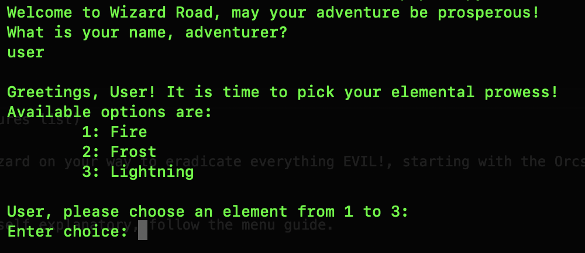
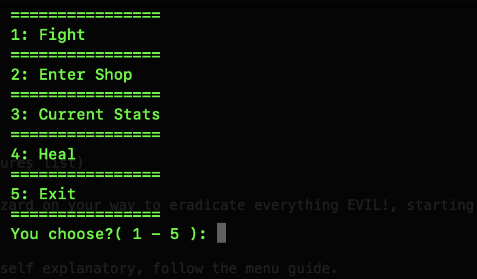
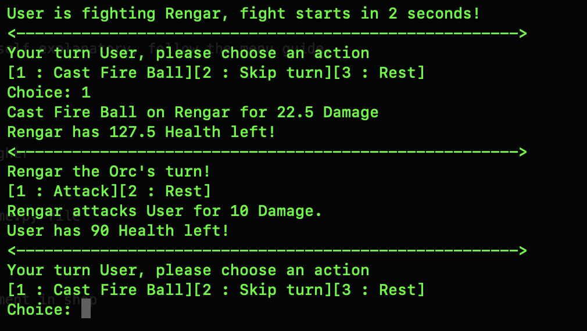

## Wizard Road - A CLI RPG Adventure

**Description**

- Wizard Road is a turn-based rpg game meant to be played within the cli. Fight monsters, gain experience,
learn exotic spells and thrive! This project's main idea was to give me some practice with OOP principles and concepts.
I feel that it can still be improved, but for the time being it has served its' purpose.

## Table of Contents

- [Demo]
	- 
	- 
	- 
- [Features]
	- Thrilling battles
	- Unique spells based on Element
	- FANTASTIC first three battles (Only ones so far...)
- [The World & Story]
	- In Wizard Road you are an elder Wizard on your way to eradicate everything EVIL!, starting with the Orcs(to determine other enemies).
- [Gameplay]
	- [Controls]
		- Controls are quite simple and self explanatory, follow the menu guide.
		- When fighting, you can choose from 1 to 5 depending on your skills
	- [Difficulty & Modes]
		- For future development...
- [Quick Start]
	- [Requirements]
		- Python3 preferrably 3.10 or higher
	- [Install]
		- 1. Clone the Repo 
			- $ git clone https://github.com/RoshiSecOps/Wizard-Road-CLI-RPG.git
		- 2. Start the game via Start_game.py file 
			- $ python3 Start_game.py
		- 3. Enjoy!
- [Roadmap / Future Improvements]
	- Add Mana consumption mechanic
	- Add stronger/elite enemies

